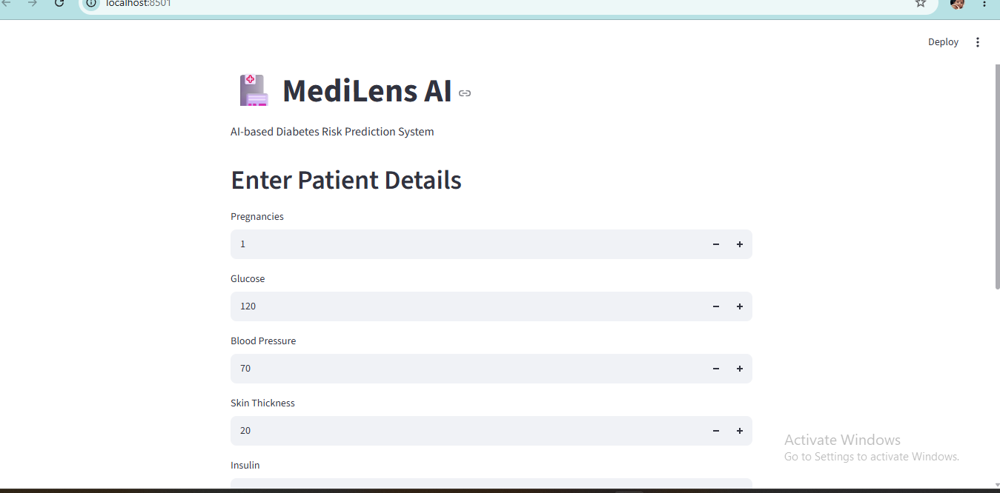
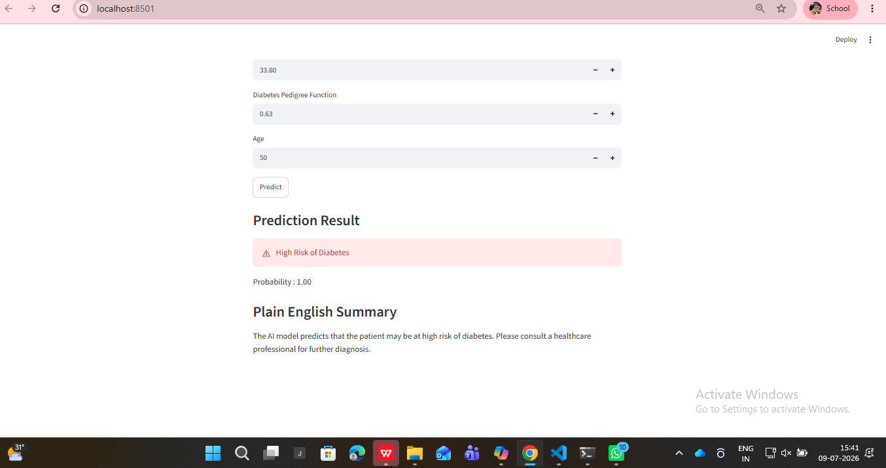

# MediLens AI

AI-powered healthcare diagnosis assistant using Machine Learning and Deep Learning.

## About Project

MediLens AI is a healthcare AI project that predicts diseases using medical data.
It uses Machine Learning, Deep Learning, Computer Vision, and Explainable AI techniques.

## Features

- Diabetes prediction using Machine Learning
- Chest X-ray disease classification using CNN
- Transfer Learning using MobileNet
- Explainable AI using SHAP
- Medical data analysis

## Technologies Used

- Python
- NumPy
- Pandas
- Scikit-learn
- TensorFlow / Keras
- Streamlit
- SHAP

## Project Structure
MediLens_AI_Project

├── app
│ └── app.py
│
├── data
│ └── diabetes
│
├── models
│ ├── logistic_model.pkl
│ └── random_forest.pkl
│
├── notebooks
│
└── requirements.txt

## Dataset

Large datasets are not included in this repository because of GitHub storage limitations.

Download datasets separately and place them inside:
data/

## Installation

Clone the repository:
git clone https://github.com/Sam-Meera/MediLens_AI_Project.git

Install requirements:
pip install -r requirements.txt

## Run Application
streamlit run app/app.py
## Screenshots

### Application Interface

### Prediction Result

## Model Performance
## Model Performance

The MediLens AI system uses multiple Machine Learning and Deep Learning models for healthcare prediction.

### Machine Learning Models

| Model | Accuracy | F1 Score |
|---|---|---|
| Logistic Regression | 75.32% | 66.07% |
| Random Forest | 72.73% | 61.82% |

### Deep Learning Model

| Model | Accuracy |
|---|---|
| CNN | 89.26% |

### Transfer Learning Model

| Model | Accuracy |
|---|---|
| MobileNet | 87.98% |

### Evaluation Metrics

The models were evaluated using:

- Accuracy
- Precision
- Recall
- F1 Score

Machine Learning Model Results:

- Precision: 64.91%
- Recall: 67.27%
- F1 Score: 66.07%
## Live Demo

Try MediLens AI here:

https://medilensaiprojectgita720329faf7ad5main-main-4fkevgufcfra6vpdm8.streamlit.app/

## Author

Sameeraja